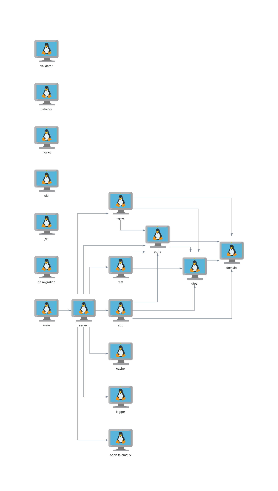

# Dependencies among the packages

Tool: [mingrammer](https://diagrams.mingrammer.com) based on [graphviz](https://www.graphviz.org/documentation/)

To generate a new version of the diagram modify the code and run `python3 diagram.py`

  

